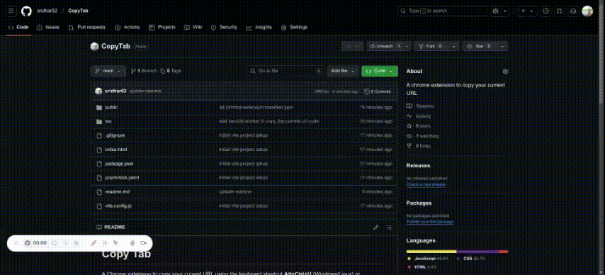

# Copy Tab

A Chrome extension to copy your current URL using the keyboard shortcut **Alt+Ctrl+U** (Windows/Linux) or **Command+Shift+U** (Mac), which will copy the URL to the clipboard.

## Tech Stack

**Client:** Vite Vanilla project

## Run Locally

Clone the project

```bash
git clone https://github.com/sridhar02/CopyTab
```

Go to the project directory

```bash
cd CopyTab
```
Install dependencies

```bash
pnpm install
```

To build the extension

```bash
pnpm run build
```

## Load the Extension in Chrome

- Open Chrome and navigate to chrome://extensions/ in the browser’s address bar.

- Enable Developer mode by toggling the switch in the top-right corner of the page.

- Click "Load unpacked" and select the dist/ folder that is generated after building the extension.

- The extension should now appear in your extensions list, and you can test it by using the specified keyboard shortcut.

## Demo



[CopyTab Demo Video](./copytab-demo.mp4)

## Authors

- [@sridhar02](https://github.com/sridhar02)

## License

[MIT](https://choosealicense.com/licenses/mit/)

